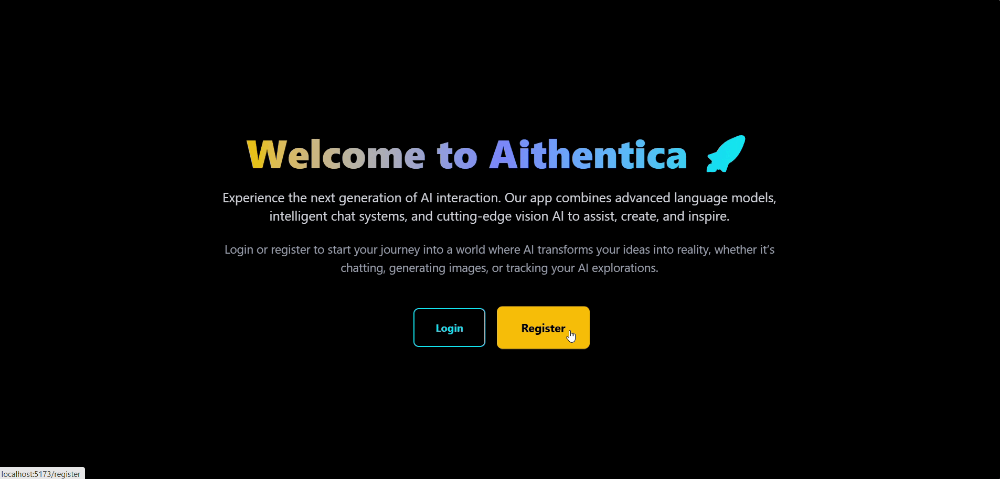

# Aithentica

A full-stack AI assistant application inspired by ChatGPT. It provides both **chat** and **vision (image generation)** features, supports multiple AI providers (OpenAI, Anthropic, Gemini, Groq, DeepSeek, Pollinations), and includes **per-user chat history and token tracking**.  

The backend is built with **Django** and **exposes RESTful API endpoints** via Django Rest Framework (DRF), with **JWT authentication** and secure refresh tokens stored as **HttpOnly cookies**. 

The frontend is built with **React** for a modern, responsive, and seamless user experience, styled with **Tailwind CSS**.

------------------------------------------------------------------------

## 📂 Project Structure

    .
    ├── backend/      # Django + DRF backend with JWT auth and AI endpoints
    ├── frontend/     # React + Vite frontend (TypeScript)
    └── README.md     # This file

------------------------------------------------------------------------

## Demo



------------------------------------------------------------------------


## ⚙️ Backend (Django + DRF)

### Features
-  **Django REST Framework** for building RESTful API endpoints.  
-  **JWT Authentication** with [`djangorestframework-simplejwt`](https://django-rest-framework-simplejwt.readthedocs.io/en/latest/).  
-  **Secure refresh tokens** stored as **HttpOnly cookies**.  
-  **AI chat endpoints** integrating multiple LLM providers: OpenAI, Anthropic, Gemini, Groq, DeepSeek, and Pollinations.  
-  **Vision support** (image generation via Pollinations API).  
-  **Chat history & token usage tracking** per user (stores the last 5 messages and token consumption).  


---

### Setup

1. **Prerequisites**
   - Install **Python** (e.g., Python 3.12).
   - Install **[uv](https://github.com/astral-sh/uv)** (Python package/dependency manager).

2. **Navigate to the backend folder:**
   ```bash
   cd backend
   ```
3. **Configure environment variables:**

   Rename .env.example to .env and fill in your keys.
   ```env
    DJANGO_SECRET_KEY=
    # Optional
    OPENAI_API_KEY=
    # Optional
    GOOGLE_API_KEY=
    # Optional
    ANTHROPIC_API_KEY=
    # Optional
    GROQ_API_KEY=
    # Optional
    DEEPSEEK_API_KEY=
   ```
4.  install dependencies:

    ```bash
    uv sync
    ```

5. Run database migrations:

    ```bash
    uv run python manage.py migrate
    ```

6. Start the development server:

    ```bash
    uv run python manage.py runserver
    ```

Backend will run at: `http://localhost:8000`

---


------------------------------------------------------------------------

## 💻 Frontend (React + Vite + TypeScript + Tailwind CSS)

### Features

- Home, Login, Register, and Dashboard pages.
- Token refresh on page load (using refresh cookie).
- Automatic retry of requests when the access token expires.
- Chat & Vision UIs with dropdowns for **Provider** and **Model** selection.


### Setup

0. **Prerequisites:**

    Node.js installed

1.  Navigate to frontend folder:

    ``` bash
    cd frontend
    ```

2.  Install dependencies:

    ``` bash
    npm install
    ```

4.  Start frontend:

    ``` bash
    npm run dev
    ```

Frontend runs on: `http://localhost:5173`

------------------------------------------------------------------------

## 🔐 Authentication Flow

-   On **login**, backend sets a `refreshToken` in an **HttpOnly Secure
    cookie**.\
-   Frontend stores the `accessToken` in `localStorage` and uses it for
    API requests.\
-   When the `accessToken` expires, frontend automatically calls
    `/auth/token/refresh/` using the refresh cookie.\
-   If refresh fails, user is logged out and redirected to `/login`.

------------------------------------------------------------------------

## 📜 License

MIT License.

